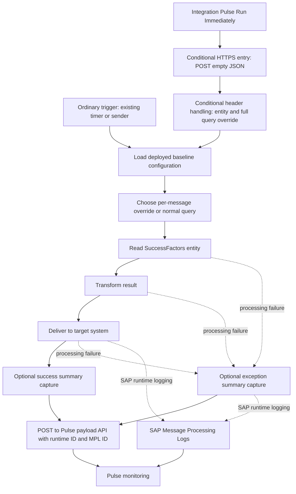

# Integration Pulse — AI iFlow Generation Contract

## 1. Purpose and Scope

This specification tells an integration-building AI how to generate SAP Cloud Integration iFlows that the existing Integration Pulse application can discover, configure, execute, and monitor. The iFlow is already deployed to the correct connected tenant. Tenant provisioning, destinations, OAuth application creation, and deployment infrastructure are outside scope.

The contract reflects the repository at commit `bca80cdad69ee1348fc8e7d064b7a20ff08f7e59`, inspected on 2026-09-21. Runtime source under `webapp/` and `backend/` takes precedence over older documentation, `source-repo/`, built `dist/` files, and mock examples. Repository references below identify exact files and functions; the full behavioral contract is included here so consumers do not need those files.

Labels used throughout:

- **REQUIRED:** Necessary for basic discovery compatibility.
- **CONDITIONAL:** Necessary only for the named optional capability.
- **OPTIONAL:** A supported choice or recommended practice, not a prerequisite for discovery.
- **UNVERIFIED:** The repository does not establish an end-to-end SAP contract; live evidence is still needed.

Current operation has two live paths: destination mode (the frontend default) and an optional FastAPI proxy. Mock success proves neither SAP compatibility nor runtime implementation. The destination path calls SAP through configured routes; the proxy maps SAP responses in Python. Differences are called out below. Evidence: `webapp/service/config.js`; `webapp/service/BackendClient.js::resolveUseMock`, `resolveLiveMode`; `backend/config.py::Settings`.

## 2. Minimum Integration Pulse Compatibility Requirements

| Level | Contract | Exact repository evidence |
|---|---|---|
| **REQUIRED — discovery** | Be returned by SAP `GET /IntegrationRuntimeArtifacts`, with a nonempty runtime `Id`. Pulse does not register iFlows using a custom property or whitelist. | `webapp/service/BackendClient.js::getDestinationIntegrations`, `runtimeArtifactsOnly`, `getIntegrations`; `backend/btp_client.py::list_integrations` |
| **REQUIRED — catalog visibility** | Runtime status, compared in uppercase, must be `STARTED`, `STOPPED`, `STARTING`, `ERROR`, or `DEPLOYING`, or the item must have a truthy deployment timestamp. `UNDEPLOYED`, `NOT_DEPLOYED`, `NOT DEPLOYED`, and `DRAFT` are always excluded. `STARTED` is not required just to appear. | `webapp/controller/Integrations.controller.js::_filterRuntimeArtifacts` |
| **OPTIONAL — custom parameters** | Zero externalized parameters and zero `pulse.*` parameters are sufficient for discovery. Missing source/target metadata puts the item under the unknown-system category. | `BackendClient.js::getIntegrations`; `Integrations.controller.js::_prepareRuntimeArtifacts`, `_groupItems` |
| **CONDITIONAL — configuration/deploy** | SAP must expose a resolvable design-time artifact and its configuration collection. Editable values must actually be externalized and consumed by the design. A runtime entry alone does not prove design-time API access. | `BackendClient.js::getDestinationConfigurations`, `resolveDestinationDesignTimeIdentity`; `backend/btp_client.py::get_configurations`, `_resolve_design_time_identity` |
| **CONDITIONAL — immediate run** | Advertise support with the exact flag and supply a reachable compatible HTTP entry point. A timer-only design is insufficient. | `IntegrationDetail.controller.js::_updateStandardFeatureFlags`, `onDeployImmediately`; `backend/btp_client.py::trigger_immediate_run` |
| **CONDITIONAL — query overrides** | Preserve the normal query and consume request-scoped override headers in the executing flow. | `IntegrationDetail.controller.js::_getPulseRunOptionsFromDialog`; `BackendClient.js::triggerDestinationIntegration`; `docs/externalized-parameters.md` |
| **CONDITIONAL — schedule editing** | Provide a recognized configuration key/label and a real schedule consumer compatible with the serialized value; merely naming a parameter `cron` is insufficient. | `IntegrationDetail.controller.js::_isTimerParam`, `_scheduleToCron`; `BackendClient.js::updateDestinationConfigurations` |
| **OPTIONAL — monitoring** | Ordinary SAP Message Processing Logs require no custom Pulse instrumentation. Captured payloads are a separate, explicitly implemented capability. | `BackendClient.js::getMessageLogs`; `backend/btp_client.py::get_message_logs`; `backend/routers/payloads.py::create_payload` |

These conditions describe the existing deployed artifact; they do not require redeployment simply to obtain compatibility certification. An empty configuration collection is valid, but a failed configuration request can prevent the detail screen from finishing its load even when the catalog item is visible. Evidence: `webapp/controller/IntegrationDetail.controller.js::_load` loads configuration before setting the integration/detail models.

## 3. Required and Conditional Externalized Parameters

### 3.1 Exact names and values

Parameter names are **case-sensitive**: lookup uses `oParam.key === sKey`. All values should be transported as strings; `DataType` is metadata, not automatic runtime behavior. Lookup returns the current truthy value, otherwise `defaultValue`, otherwise the empty string. Thus an empty current value may fall back to a default where the data source supplies one. Evidence: `webapp/controller/IntegrationDetail.controller.js::_findParam`, `_findParamValue`; `backend/models.py::Configuration`.

No parameter in this table is required for basic discovery.

| Exact name | Classification and purpose | Type, accepted values, and absent behavior | SAP configuration and runtime dependency | Example | Evidence |
|---|---|---|---|---|---|
| `pulse.immediateRunSupported` | **CONDITIONAL** for exposing Run Immediately | String parsed as Boolean: trim, lowercase, then accept only `true`, `yes`, `y`, `1`. `true`, `True`, and `TRUE` are identical. All other strings, including `false`, `0`, `on`, or absent/empty without a default, disable it. | Externalize with configured string `true` only when the endpoint implements section 6. The flag creates no sender or processing logic. | `true` | `IntegrationDetail.controller.js::_isTruthyParamValue`, `_updateStandardFeatureFlags`, `onDeployImmediately` |
| `pulse.immediateRunEndpoint` | **CONDITIONAL** endpoint override for immediate run; optional only when usable runtime endpoint metadata exists | String address; no intrinsic default. Frontend returns an empty string when absent. The transport can fall back to the integration's endpoint metadata; proxy additionally looks up that metadata. See path restrictions in section 6. | Expose the actual HTTPS sender address, preferably by externalizing its Address field. Wire that sender to the intended business execution. | `/IntegrationPulse/EmployeeExport` | `IntegrationDetail.controller.js::_getImmediateRunEndpoint`; `BackendClient.js::triggerDestinationIntegration`; `btp_client.py::trigger_immediate_run` |
| `pulse.Source` | **CONDITIONAL** for SuccessFactors EDMX upload controls | String; remove whitespace, underscores, and hyphens, then lowercase; only resulting `successfactors` activates the gate. `SuccessFactors`, `success factors`, and `SUCCESS_FACTORS` work; `SF` does not. Absent means false. Other source strings have no specialized behavior. | Expose as configuration metadata. No script is needed merely to enable the UI; actual queries need section 7 logic. This does not set catalog Sender. | `SuccessFactors` | `IntegrationDetail.controller.js::_isSuccessFactorsSource`, `_openPulseRunDialog` |
| `pulse.entity` | **OPTIONAL** entity fallback; **CONDITIONAL** if chosen to provide the entity for EDMX/query execution | String entity set/type, no enum validation. Priority is `SFResourcePath`, then `pulse.entity`, then `extract.entity`, then empty. Empty entity produces no entity headers. | Externalize only if this is the chosen entity source. Keep it consistent with the adapter's entity; consume the entity header if dynamic entity routing is intended. | `EmpJob` | `IntegrationDetail.controller.js::_getSfResourcePath`, `_getPulseRunOptionsFromDialog`; `BackendClient.js::triggerDestinationIntegration` |
| `SFResourcePath` | **CONDITIONAL** when used as the primary entity configuration; otherwise optional | String, highest priority. No entity default in application code. Must match uploaded EDMX entity set or entity type for EDMX browsing. | Externalize the configured resource and connect it to the business adapter where appropriate. An entity header alone does not change the adapter. | `EmpJob` | `IntegrationDetail.controller.js::_getSfResourcePath`, `_buildEdmxQueryOptions` |
| `extract.entity` | **OPTIONAL** third entity fallback | String; ignored for Pulse entity selection when either higher-priority key is nonempty. | Ordinary externalized configuration; runtime meaning belongs to the generated flow. | `EmpJob` | `IntegrationDetail.controller.js::_getSfResourcePath`; `webapp/localService/mockdata/configurations.json` |
| `filter.query` | **CONDITIONAL** for preserving an existing baseline in the additive query UI | String query options, e.g. `$select=...&$filter=...`; optional leading `?`. Absent means empty baseline. No query validation against SAP metadata. | Externalize the normal query and load its deployed value into normal execution. The UI uses its current configuration-model value. | `$select=userId,startDate&$filter=active%20eq%20true` | `IntegrationDetail.controller.js::_openPulseRunDialog`, `_parsePulseQuery`; `docs/externalized-parameters.md` |

For flags or metadata without a natural adapter field, an **OPTIONAL illustrative** implementation is to externalize a supported Content Modifier value. The required observable result is a real `Configurations` row, not a particular Content Modifier name. See section 5.

### 3.2 Related names that are not special externalized configuration contracts

| Name | Actual status and generator decision | Evidence |
|---|---|---|
| `filter.pulseQuery` | Runtime HTTP header alias recognized by the sending code. Also documented as a transient exchange-property convention and present as a blank test-fixture configuration. Pulse does **not** read its externalized value to construct the override or persist the override into it. **OPTIONAL** exchange-property name; no externalized definition is necessary. | `BackendClient.js::triggerDestinationIntegration`; `btp_client.py::trigger_immediate_run`; `tests/fixtures/contracts.json`; `docs/externalized-parameters.md` |
| `filter-pulseQuery`, `X-Pulse-Query` | Additional equivalent HTTP headers; not externalized parameter lookups. **CONDITIONAL:** consume at least one surviving alias when query overrides are supported. | Same transport functions above |
| `X-Pulse-Entity` | HTTP alias of the outgoing `pulse.entity` header; not an externalized parameter lookup. | Same transport functions above |
| `filter.SFQuery` | Documented name for the final per-message query property. No frontend/backend special lookup. **OPTIONAL** implementation convention; the adapter must consume whichever final property the generator chooses. | `docs/externalized-parameters.md`; `tests/fixtures/contracts.json`; `IntegrationDetail.controller.js::_findParamValue` call sites |
| `pulse.selectQuery`, `pulse.expandQuery` | Found in shipped mock configuration data, but not consumed by the current query builder. Generic display/edit only; no accepted-value parser, required default, or special runtime behavior. **OPTIONAL** ordinary string parameters, normally omit. Examples are `userId,startDate` and `companyNav`. | `webapp/localService/mockdata/configurations.json`; `IntegrationDetail.controller.js::_openPulseRunDialog`, `_buildPulseGeneratedQuery` |
| `timer.cron` | Test-fixture example of the naming heuristic, not a reserved fixed key. | `tests/fixtures/contracts.json`; `IntegrationDetail.controller.js::_isTimerParam` |

Repository-wide searches of Pulse-prefix and header variants found no other actively consumed Pulse externalized properties. `integrationPulse.designTimeMetadata.v1`, `integrationPulse.edmxOptions.v2`, review/resolution storage keys, UI5 namespaces, and `INTEGRATION_PULSE_*` backend environment variables are not iFlow parameters. There is no implemented `pulse.Name`, `pulse.Description`, `pulse.Target`, registration flag, capture flag, or custom grouping property. Do not invent these as compatibility requirements.

## 4. Integration Discovery and Metadata

### 4.1 Identity and association

Pulse uses the runtime artifact `Id` for catalog identity, navigation, MPL filtering, and payload collection lookup. **CONDITIONAL:** for payload correlation, use this exact ID rather than a display name or package ID. Evidence: `BackendClient.js::mapIntegration`, `getMessageLogs`, `getPayloads`; `MonitoringDetail.controller.js::_load`.

Destination mapping tries design-time identity fields in this order: `IntegrationDesigntimeArtifactId`, `DesigntimeArtifactId`, `DesignTimeArtifactId`, `ArtifactId`, runtime `Name`, runtime `Id`. Design-time lookup candidates include the mapped ID, runtime ID, and name. Version candidates begin with known design-time version, then `Active`, `active`, runtime version. The Python client uses explicit identity fields or an empty string, then includes runtime ID/name; its version sequence begins with `Active`, `active`, then known versions. Fallback searches use SAP Id/Name filters and package-scoped matching. Match normalization removes whitespace, `_`, and `-` and lowercases; package fallbacks allow substring matches or a sole package artifact. These are heuristics, not a guarantee of uniqueness.

**OPTIONAL recommendation:** maintain an unambiguous relationship between runtime and design-time identity; avoid depending on fuzzy name or sole-package matching. **CONDITIONAL:** before a configuration write, validate that the resolved design artifact and version are the intended ones. Retrieval and mutation resolve separately and can prefer different versions. The detail controller passes `designTimeId || runtimeId` for configuration writes. Evidence: `BackendClient.js::getDesignTimeIdCandidates`, `getDesignTimeVersionCandidates`, `getFallbackConfigurationCandidates`, `tryGetConfigurationsForVersions`, `resolveDestinationDesignTimeIdentity`; `btp_client.py::_design_time_candidates`, `_matched_design_time_items`; `IntegrationDetail.controller.js::_getConfigurationArtifactId`.

### 4.2 SAP-supplied fields versus developer input

| Information | Pulse source and behavior | Builder responsibility |
|---|---|---|
| ID, name | Runtime `Id`, `Name`; destination mapping falls back to ID for missing/empty name | Choose normal artifact ID/name during design; no duplicate Pulse parameter |
| Description | Runtime `Description`; empty if unavailable; destination design enrichment does not add a description | Maintain normal SAP artifact description if useful; no special Pulse property |
| Version, status, deployed timestamp | SAP `Version`, `Status`, `DeployedOn` (frontend also accepts `LastDeployedOn`) | SAP/runtime lifecycle provides these; do not synthesize parameters |
| Package | `PackageId` and frontend `PackageName` fallback; destination enrichment may fill a missing package | Normal SAP packaging; package metadata is not a visibility prerequisite or catalog grouping key |
| Source and target | Runtime `Sender`/`Receiver`; frontend also accepts source/target field aliases. Destination design enrichment fills from design-time `Sender`/`Receiver`, preferring those nonempty values | **CONDITIONAL** for named grouping: SAP responses must expose appropriate system metadata. Maintain normal sender/receiver participant metadata, then verify what SAP actually returns |
| Endpoint | Runtime `Endpoint`/`Url`, overridden by the explicit run parameter | **CONDITIONAL** for immediate run: provide a real endpoint, not just text metadata |

Evidence: `BackendClient.js::mapIntegration`, `mapDesignTimeMetadata`, `withDesignTimeMetadata`; `btp_client.py::list_integrations`.

Catalog groups use formatted sender/receiver strings: trim, replace underscores/hyphens with spaces, split camel case, normalize selected acronyms, and fall back to the localized unknown-system label. `pulse.Source` is never read here. Proxy mode does not perform destination-style design-time metadata enrichment. **UNVERIFIED:** this repository contains response mappings and fixtures, not proof that a given SAP adapter/participant design exposes `Sender`, `Receiver`, package, or endpoint fields in every tenant. Do not promise named grouping from adapter type, artifact naming, or `pulse.Source` alone. Evidence: `Integrations.controller.js::_formatSystemName`, `_prepareRuntimeArtifacts`, `_groupItems`; `BackendClient.js::enrichIntegrationMetadata`; `btp_client.py::list_integrations`.

## 5. Externalized Configuration Design

**CONDITIONAL — editable configuration:** define each user-editable value as a SAP externalized parameter exposed by `GET /IntegrationDesigntimeArtifacts(Id='...',Version='...')/Configurations`, with the exact `ParameterKey`, string `ParameterValue`, and valid `DataType`. A runtime header or exchange property alone is not exposed by this API. Evidence: `BackendClient.js::getConfigurationsForCandidate`, `mapConfiguration`; `btp_client.py::get_configurations`.

SAP authoring procedure: use a supported component field's Externalize action, assign `{{parameterName}}`, define its default, and save the design. Configure the parameter's value in the artifact configuration. Configured values take precedence over defaults. A generated artifact must contain the equivalent externalized definition and field binding, not just text mentioning the key. This SAP mechanism supplements the API requirement; see [SAP externalization documentation](https://help.sap.com/docs/cloud-integration/sap-cloud-integration/externalize-parameters-of-integration-flow). Exact generated ZIP/XML serialization is **UNVERIFIED** here; no generator schema is supplied by this repository.

Example: **OPTIONAL** `extract.pageSize=500`, `DataType=xsd:integer`, can control employee batch/page size if its actual processing field is bound to `{{extract.pageSize}}` or an initialized runtime value consumed by the flow. The name is a mock example, not a required standard. Correct: the configuration API returns that key and processing uses its configured value. Incorrect: only a Groovy local variable named `extract.pageSize`, a hard-coded adapter size, or an externalized but unused parameter. Pulse can neither discover the local variable nor make the unused parameter affect processing. Evidence: `webapp/localService/mockdata/configurations.json`; API retrieval functions above.

Grouping uses the prefix before the first dot; keys without a dot go to General. Named groups in order are `pulse`, `extract`, `filter`, `include`, `delivery`, `audit`, `sftp`, `general`; unknown prefixes are displayed with an initial capital. There is no mandatory general naming convention and no dot-prefix-derived runtime behavior. Evidence: `IntegrationDetail.controller.js::GROUP_LABELS`, `_groupParams`.

Ordinary controls are text inputs even for `xsd:boolean`, `xsd:integer`, and `xsd:date`; the type string is preserved when saving. No general enum, numeric-range, or date validation is implemented. Defaults are placeholders; Reset restores loaded/pristine values, not SAP defaults. Feature lookup may fall back to supplied defaults, but Python live mapping does not retrieve default metadata. Evidence: `IntegrationDetail.view.xml` parameter Input; `IntegrationDetail.controller.js::_groupParams`, `_collectParams`, `onReset`; `backend/models.py::Configuration`.

`secure=true` masks the input; `readOnly=true` disables ordinary editing. Destination mapping accepts `Secure`/`secure`, `ReadOnly`/`readOnly`, `DefaultValue`/`defaultValue`; Python live mapping supplies only key, label, value, type and leaves secure/readOnly false and default empty. Boolean coercion in the frontend means string `"false"` would be truthy for these metadata flags. **UNVERIFIED:** SAP supplying these flags as expected. Masking is not credential storage, and naming a parameter `sftp.password` does not automatically mask it. **OPTIONAL recommendation:** use managed SAP security-material references rather than secrets in editable strings. No credentials belong in generated examples. Evidence: `BackendClient.js::mapConfiguration`; `btp_client.py::get_configurations`; `IntegrationDetail.view.xml`.

**CONDITIONAL — safe saves:** design the configuration surface with awareness that `_collectParams` submits **all** loaded parameters, including unchanged and read-only ones, as `{key,value,dataType}`. Save Draft sends an OData batch containing PUTs to `.../$links/Configurations('key')`; Deploy saves first and then posts `DeployIntegrationDesigntimeArtifact` for one resolved artifact. Neither operation creates runtime code or binds unused parameters. Embedded batch errors are checked. Deployment acceptance (`STARTING`) is not confirmation of successful runtime startup. Evidence: `IntegrationDetail.controller.js::_collectParams`, `onSaveDraft`, `_doDeploy`; `BackendClient.js::updateDestinationConfigurations`, `deployDestinationIntegration`, `assertBatchSucceeded`; `btp_client.py::update_configurations`, `deploy_integration`; `tests/js/backend-client.test.cjs` test `save batch is lossless, uses resolved identity and precedes deploy; never triggers run`.

## 6. Immediate-Run Design Contract

**CONDITIONAL — execution entry:** implement an HTTPS sender-compatible endpoint accepting `POST` with literal body `{}`, `Content-Type: application/json`, and `Accept: application/json`. It must initiate the intended business work without requiring a supplied employee/business payload. Pulse does not invoke the timer or infer the business logic from the flag. Evidence: `BackendClient.js::triggerDestinationIntegration`; `btp_client.py::trigger_immediate_run`.

**CONDITIONAL — endpoint selection:** set `pulse.immediateRunEndpoint` to that endpoint unless usable runtime endpoint metadata is available. Relative addresses `IntegrationPulse/EmployeeExport` and `/IntegrationPulse/EmployeeExport` become `/http/IntegrationPulse/EmployeeExport`; an existing `/http/...` is retained. There is no mandatory `/IntegrationPulse` namespace. Use a specific nonempty `/http/...` path for compatibility across both modes. Evidence: `BackendClient.js::normalizeImmediateRunEndpoint`, `getImmediateRunUrl`; `btp_client.py::_join_runtime_endpoint`.

The proxy requires HTTPS on its configured runtime origin, permits absolute URLs only on that exact scheme/host/port, and rejects userinfo, fragments, protocol-relative URLs, traversal, nested encoding, backslashes, control characters, and empty sender paths. Absolute paths must already begin `/http/`. Destination mode has looser URL joining and preserves HTTP(S) absolute URLs; relying on that looser behavior is not portable to proxy mode. Proxy headers must contain printable ASCII; the query builder percent-encodes query values. Evidence: `_join_runtime_endpoint`, `trigger_immediate_run`; `tests/backend/test_approved_fixes.py`; `tests/backend/test_contracts.py`.

The proxy adds its SAP bearer token. Destination mode uses `credentials: include` and leaves authentication to existing routing; it does not explicitly add an Authorization header. **CONDITIONAL:** the sender must work with the already-established execution authentication. No new connection setup is prescribed. Successful HTTP status is enough; no response JSON schema or MPL ID is read. The browser checks `res.ok` (2xx); Python uses `raise_for_status`. Return a 2xx response for interoperable acceptance. `TRIGGERED` means the request succeeded, not that processing completed. The proxy request timeout is 120 seconds. Evidence: the two trigger functions above.

| Arrangement | What current code establishes |
|---|---|
| Timer only, no HTTPS entry | Cannot support the Pulse run request; omit the flag or set `false` |
| Timer plus separate HTTPS entry into equivalent work | Intended documented use; Pulse sends HTTP and leaves schedule/configuration unchanged |
| Existing HTTP-triggered business flow | Transport can call it if it accepts this exact POST/body and flags/endpoint are configured; no second sender is demanded by code |
| Multiple sender channels or companion trigger artifact | Pulse selects one endpoint string; it performs no sender enumeration or topology validation. SAP validity and resulting artifact/MPL association require live proof |

Evidence: `docs/externalized-parameters.md`; `IntegrationDetail.controller.js::_doDeployImmediately`; `BackendClient.js::triggerImmediateRun`; `btp_client.py::trigger_immediate_run`. The word “separate” in existing documentation describes separation from timer execution, not proof that a particular multi-sender BPMN topology is supported. A ProcessDirect bridge, local process, or asynchronous queue is an **OPTIONAL implementation choice**, not a mandated Pulse component.

Immediate execution calls neither configuration update nor deploy. Unsaved dialog/source/endpoint/baseline values may nevertheless influence the outgoing run options because they are read from the current UI model. **CONDITIONAL:** validate against the deployed baseline when certifying query behavior; do not assume Save happened implicitly. Evidence: `IntegrationDetail.controller.js::_findParamValue`, `_getPulseRunOptionsFromDialog`, `_doDeployImmediately`; `tests/js/backend-client.test.cjs` immediate-run and additive-query tests.

## 7. SuccessFactors-Specific Design Contract

### 7.1 UI and query construction

**CONDITIONAL — EDMX tools:** use `pulse.Source=SuccessFactors` and enable immediate execution to reach the run dialog's EDMX upload controls. Source matching is described in section 3. The generic select, expand, filter, and generated-query groups are currently constructed even for non-SuccessFactors sources; only the EDMX tools container is gated. This is narrower than some older prose implies. Evidence: `IntegrationDetail.controller.js::_openPulseRunDialog`, `_isSuccessFactorsSource`.

**CONDITIONAL — baseline preservation:** expose the normal query as `filter.query` if Pulse should preserve it while users add options. Parsing strips an optional initial `?`, splits `&` pairs, decodes percent escapes and `+` spaces, accepts `select`, `expand`, `filter` with or without `$`, and preserves other options. Recognized option keys are case-sensitive. Baseline select/expand values are merged and deduplicated with additions; normal picker baseline values cannot be removed. The baseline filter and added filter become `(baseline) and (addition)` when both exist. Other options survive regeneration. Evidence: `_parsePulseQuery`, `_mergePulseQueryValues`, `_combinePulseFilterQuery`, `_formatPulseQueryParts`, `_buildPulseGeneratedQuery`.

Filter rows are joined with `and`; `in` becomes equality alternatives joined by `or` and parenthesized. Operators include `eq`, `ne`, `gt`, `ge`, `lt`, `le`, `contains` (serialized as `substringof`), `startswith`, `notstartswith`, `endswith`, `notendswith`, `toupper_eq`, `tolower_eq`, `trim_eq`. Numeric-looking values and Boolean/null literals are unquoted; other strings are single-quoted with apostrophes doubled. This is not an EDMX type-aware query validator. Numeric-looking string identifiers and date literals need live correctness checks. Evidence: `_formatPulseFilterValue`, `_buildPulseFilterExpression`, `_buildPulseFilterQuery`.

The generated value is a **complete query-options string**, not just an additional `$filter` expression. Select/expand retain commas/slashes; query values otherwise use `encodeURIComponent`. Normalized comparison with the baseline suppresses the query override entirely when unchanged. Entity headers can still be sent on unchanged runs. Evidence: `_formatPulseQueryParts`, `_isPulseQueryUnchanged`, `_getPulseRunOptionsFromDialog`.

### 7.2 Wire and runtime handling

When the query is nonempty and changed, Pulse sends the same string in:

```text
filter.pulseQuery
filter-pulseQuery
X-Pulse-Query
```

When the resolved entity is nonempty it sends both `pulse.entity` and `X-Pulse-Entity`. These are HTTP headers, not fields in the `{}` request body. The proxy request DTO also accepts legacy `filterQuery`, using `pulseQuery or filterQuery`; the current UI uses `pulseQuery`. Evidence: `BackendClient.js::triggerDestinationIntegration`; `backend/routers/integrations.py::trigger_immediate_run`; `backend/models.py::ImmediateRunRequest`.

**CONDITIONAL — query-capable runtime:** allow the custom inbound headers through the sender/runtime configuration, select a supplied alias, and use the supplied full query for that message only. If no nonblank override exists, use the deployed normal query. Keep the original `filter.query` unchanged in configuration and runtime baseline storage. Do not write an override to SAP configuration, a persistent global variable, or a reusable data store. Evidence: the trigger functions send only request headers; `docs/externalized-parameters.md::Recommended Runtime Flow` and `Header Names Sent by Integration Pulse`; `tests/js/backend-client.test.cjs` test `real controller → additive query → real client → all three headers`.

The documented allowed-header example is `X-Pulse-Query|filter-pulseQuery|filter.pulseQuery`. If consuming entity headers, allow those too. **UNVERIFIED:** exact sender/adapter-version allowlist behavior; verify surviving header names/casing on the tenant. HTTP names are case-insensitive on the wire, but script map lookup behavior must be checked.

Illustrative runtime algorithm (pseudocode, not a deployable script):

```text
baseline := deployed externalized filter.query
override := first nonblank incoming header among
            X-Pulse-Query, filter-pulseQuery, filter.pulseQuery
finalQuery := override if present else baseline
set message-local filter.pulseQuery := override or empty
set message-local filter.SFQuery := finalQuery
execute SuccessFactors request using finalQuery
```

The alias priority and exchange-property names in this example are **OPTIONAL** choices. The required behavior is per-message override/fallback with a connected adapter query consumer. A Content Modifier can initialize the baseline from `{{filter.query}}`; a script or equivalent expression can choose the final property. Do not concatenate the override onto the baseline: it already contains the baseline. Do not decode/re-encode the entire string blindly, which can turn escaped `&` inside values into option separators. **UNVERIFIED:** the specific SuccessFactors adapter field's expression and encoding requirements; prove that the actual outgoing OData request has the intended semantics. No supplied SAP artifact or Groovy implementation establishes them here.

Entity metadata may be used simply to describe a fixed adapter entity. If dynamic entity selection is implemented, **CONDITIONAL:** consume/validate the incoming entity against the design's supported entity and mapping; otherwise keep the fixed adapter entity aligned with the advertised value. Pulse does not enforce this alignment. Evidence: `_getSfResourcePath` and the transport header setters.

### 7.3 EDMX upload and selection

EDMX is uploaded into the browser, parsed locally, and cached in local storage by trimmed resource path. It is not sent to the iFlow, installed in SAP, or used to generate adapter configuration. The resource resolves first through `EntitySet.Name -> EntityType`, otherwise directly as an entity type; missing roots fail. The parser accepts `Edmx`/`Schema`, reads properties and association-based navigation targets, and rejects malformed XML, DOCTYPE/ENTITY declarations, and duplicate identities. It is not proof of arbitrary OData-version compatibility. Evidence: `_uploadPulseEdmx`, `_parseEdmxMetadata`, `_buildEdmxQueryOptions`, `_getEdmxOptionsCacheKey`, `_storeEdmxOptions`; `tests/fixtures/successfactors.edmx`; `tests/js/controllers.test.cjs` EDMX tests.

**CONDITIONAL — usable EDMX selection:** provide one recognized entity configuration matching the relevant EDMX and ensure the adapter, permissions, and mappings tolerate selected fields/navigation. No iFlow metadata-serving endpoint or EDMX-upload receiver is required. The dialog obtains its root from configuration; it does not discover a different execution entity from the sender. Cached metadata is not tenant-scoped, so verify that the uploaded file matches the actual source system.

## 8. Scheduling Contract

**CONDITIONAL — schedule editor detection:** the lowercased combination of parameter key and label must match JavaScript `/\b(timer|cron|schedule|frequency)\b/`. `timer.cron`, `schedule`, and `delivery.frequency` match. `cronExpression` and `timer_interval` do not match by key alone (underscore is a word character); a matching label could still activate the editor. Live API labels generally equal parameter keys. Evidence: `IntegrationDetail.controller.js::_isTimerParam`; `BackendClient.js::mapConfiguration`; `btp_client.py::get_configurations`.

There is no timer-adapter discovery API call. The UI parses the configuration value, falling back to a supplied default for the schedule model. Every loaded schedule initially uses Advanced mode. It recognizes positional fields `seconds minutes hours day-of-month month day-of-week [year]` plus a trailing application syntax `--tz=Zone`. It is a string editor, not a complete cron validator. Evidence: `_groupParams`, `_scheduleFromCron`.

| UI mode | Current serialization, before optional timezone suffix |
|---|---|
| Run Once | `0 minute hour day MONTH ? year` |
| Schedule on Day | `0 minute hour ? * MON,TUE *` (chosen weekdays) |
| Recur by minutes | `0 0/N * ? * * *` |
| Recur by hours | `0 0 0/N ? * * *` |
| Recur by days | `0 minute hour 1/N * ? *` |
| Advanced | Preserves untouched original fields, including weekday and special tokens; replaces edited supported fields; keeps existing step divisor when changing its starting value |

A recurrence interval is clamped to at least 1. Day recurrence is the serialized day-of-month expression, not a guaranteed elapsed-N-days schedule. If unchanged, Advanced returns the exact original string. Edited Advanced values with fewer than six or more than seven fields throw unless the user chooses a replacement mode. Thus five-field Unix cron is not a supported editable contract, even though an untouched string can survive. Evidence: `_scheduleToCron`; `tests/js/controllers.test.cjs` schedule round-trip tests and cron regressions.

The default displayed timezone is `America/Los_Angeles`; choices include that zone, `America/New_York`, `UTC`, and `Europe/London`. Generated modes append ` --tz=<zone>` when a zone is present; unchanged Advanced values without a suffix retain their absence. These are Pulse serializer behaviors, **not evidence that SAP accepts the suffix**. Evidence: `_createScheduleOptions`, `_scheduleFromCron`, `_scheduleToCron`.

**CONDITIONAL — operational schedule support:** externalize a real scheduler input and demonstrate that the component consumes the exact value Pulse saves, including timezone treatment. Saving/deploying a string named `timer.cron` does not bind or reprogram a timer automatically. **UNVERIFIED:** native timer support for these precise six/seven-field strings and `--tz=` syntax; no adapter conversion is implemented in Pulse. If that mapping cannot be demonstrated, omit claims of Pulse schedule support, retain normal SAP scheduling, and do not invent an in-message Groovy “scheduler”—message processing cannot change its own start timer by reading a property. Evidence: update paths only PUT configuration strings; `docs/qa/manual-bas-sap.md` schedule validation; controller serializer above.

## 9. Monitoring and Payload-Capture Contract

### 9.1 Standard execution monitoring

Standard monitoring needs no custom Pulse header, property, correlation ID, or manually set status. Pulse queries SAP MPLs with `IntegrationFlowName eq '<runtime-id>'`; maps `MessageGuid`, `Status`, `Sender`, `LogEnd`, and `CustomStatus`; and displays the results. Destination mode also maps `Duration` and `ErrorMessage` fallbacks; Python currently supplies `durationMs=0` and maps `CustomStatus` as error text. It does not retrieve every SAP error attachment automatically. Evidence: `BackendClient.js::getMessageLogs`, `mapMessageLog`; `btp_client.py::get_message_logs`.

History requests the latest 50 records ordered by `LogEnd desc` and hides `DISCARDED` entries. Separately, 24-hour counters page through logs, deduplicate MessageGuid, exclude discarded entries, and count `FAILED`. Local review/resolution state is not a SAP message-status update. **CONDITIONAL — meaningful monitoring:** the actual business run must produce MPLs under the selected runtime artifact; a companion trigger artifact may have a different MPL and is not automatically correlated by Pulse. Evidence: `BackendClient.js::visibleMessageLogs`, `getRecentLogCounts`; `btp_client.py::_get_recent_logs`; `MonitoringDetail.controller.js::_attachPayloads`, `onResolvedSelect`.

### 9.2 Optional capture wire contract

Payload capture is **OPTIONAL**. MPL availability, trace logging, MPL attachments, and `audit.enabled` do not automatically populate Pulse's payload service. **CONDITIONAL — capture:** explicitly send an HTTP `POST` to the existing Pulse backend's `/payload-api/v1/payloads`. This is the Pulse service origin, not SAP's `/api/v1`. Evidence: `backend/routers/payloads.py::router`, `create_payload`; `webapp/service/config.js::payloadBaseUrl`.

Two supported request forms:

```http
POST /payload-api/v1/payloads
Content-Type: application/json

{
  "integrationId": "EmployeeExport",
  "messageId": "<actual SAP MPL MessageGuid>",
  "fileName": "run-summary.json",
  "contentType": "application/json",
  "payload": "{\"status\":\"Success\",\"recordsProcessed\":125}"
}
```

Here `payload` is a **string**, including when that string contains JSON. The angle-bracket message ID is a placeholder, never a literal value to send.

Alternatively send raw UTF-8 JSON, CSV, XML, or plain text with the actual media type and metadata:

```http
POST /payload-api/v1/payloads?integrationId=EmployeeExport&messageId=<URL-encoded-MPL-ID>&fileName=run-summary.json
Content-Type: application/json

{"status":"Success","recordsProcessed":125}
```

| Field | Current receiver contract |
|---|---|
| `integrationId` | **CONDITIONAL required for capture:** provide the exact catalog runtime ID. JSON wrapper requires a string field; raw mode requires a nonempty query/header value. Server does not validate existence against SAP. |
| `messageId` | Optional to ingestion; **CONDITIONAL required for an MPL Results link:** exact MPL `MessageGuid` for the displayed run. No correlation-ID substitution or synthetic ID. |
| `fileName` | Optional, default `payload.txt`; control characters rejected. Metadata, not a server filesystem path. |
| `contentType` | Wrapper optional, default `text/plain`; raw mode uses HTTP Content-Type without its charset portion, default `text/plain`. |
| `payload` | Required string in wrapper; raw body otherwise. Raw bytes decode as UTF-8 with replacement for invalid sequences; not a binary-file contract. |

Raw metadata aliases are `X-Integration-Id` / `X-IntegrationId`, `X-Message-Id` / `X-MessageId`, `X-File-Name` / `X-Filename`. HTTP header names are case-insensitive. Query values take precedence over headers. A valid JSON wrapper takes precedence over raw metadata. JSON bodies containing a top-level `payload` field are attempted as wrappers; invalid wrappers fall back to raw handling, so avoid ambiguous raw objects or deliberately use the wrapper. Evidence: `backend/models.py::PayloadCreateRequest`; `backend/routers/payloads.py::create_payload`; `tests/backend/test_payloads.py::PayloadRoutes`.

The response is HTTP 200 with `id`, integration/message IDs, filename, content type, UTF-8 `sizeBytes`, server `createdAt`, `expiresAt`, `previewAvailable`, and `downloadOnly`. Do not supply IDs/timestamps for the capture record itself. Up to 102400 bytes can preview; larger text is stored as download-only. Expiration is seven days, pruned on storage access. Repeated posts create separate records; no idempotency key exists. Monitoring attaches the first matching payload in the supplied list; storage lists newest first. **OPTIONAL recommendation:** one summary per MPL avoids ambiguous multiple results. Evidence: `payloads.py::create_payload`, `get_payload`; `payload_storage.py::create_payload`, `list_payloads`, `prune_expired`; `MonitoringDetail.controller.js::_attachPayloads`.

### 9.3 iFlow capture implementation

For a flow advertising correlated capture, the following steps are **CONDITIONAL**:

1. Read the actual MPL ID for the business execution and retain it per message. Repository guidance identifies the `SAP_MessageProcessingLogID` header; SAP documents it as a read-only MPL identifier. Do not replace or manufacture it. Evidence: `docs/integration-pulse/source/08-payload-capture-privacy.md::Message Processing Log association`; [SAP framework headers](https://help.sap.com/docs/cloud-integration/sap-cloud-integration/headers-and-exchange-properties-provided-by-integration-framework?q=SAP_ApplicationID&version=Cloud). **UNVERIFIED:** availability at the chosen capture point and exact equality to the displayed MPL in multi-flow designs.
2. Build an appropriate text summary and provide the runtime integration ID plus that message ID. The receiver does not infer them from the bearer token, filename, or body summary. Evidence: `payloads.py::create_payload`; `MonitoringDetail.controller.js::_attachPayloads`.
3. POST using a receiver call/equivalent outbound HTTP implementation and evaluate its result. Merely adding exchange properties or an MPL attachment does not invoke this API. Evidence: `payloads.py::create_payload`; `BackendClient.js::getPayloads`.

**OPTIONAL design recommendation:** capture final results after business processing, preserving the business body if the capture call changes it. If failed executions are to have results, add an exception-path capture with the same business MPL ID and a failure summary; a success-path receiver alone will not run after an earlier failure. The API has no success/failure discriminator or mandatory processing stage, so both outcomes use the same envelope. Failure policy, retry policy, and whether capture failure affects business completion are implementation choices, not an enforced Pulse contract. Do not mark a business run successful merely because ingestion succeeded. Evidence: the unrestricted string payload schema and `_attachPayloads` joining independently of status.

**CONDITIONAL — repository capture policy:** send run summaries without secrets or detailed employee payloads. The operations guide permits user IDs but prohibits other listed PII and full transactional files. No automatic redaction is implemented; the iFlow owns summary construction. Evidence: `docs/integration-pulse/source/08-payload-capture-privacy.md::Privacy policy`; `payloads.py::create_payload` stores supplied text without content inspection.

### 9.4 Authentication: current implementation versus Step 2A

**Current:** FastAPI payload routes and `main.py` contain no incoming bearer-token validation, OAuth audience/scope checks, or authentication dependency. `backend/auth.py::get_access_token` performs client-credentials authentication **outbound to SAP**, not inbound to the payload API. Deployment-level protection may exist outside this repository and is **UNVERIFIED**. CORS/security headers are not proof of ingestion authentication. Evidence: `backend/main.py` middleware and router registration; `backend/routers/payloads.py::create_payload`; `backend/auth.py::get_access_token`; `docs/qa/defects.md` architectural authentication finding.

**Planned / UNVERIFIED — Step 2A:** the requested OAuth client-credentials ingestion design is not implemented or specified under that name anywhere in the inspected repository. No verified token URL, issuer, audience, scope, credential alias, or unauthorized-response contract can be stated. The intended design-level pattern is a machine client obtaining an access token using `grant_type=client_credentials` through managed security material and sending `Authorization: Bearer <token>` on the capture POST. This is a planned pattern, not a current acceptance requirement or proof that the backend validates it. Do not reuse SAP API credentials for Pulse ingestion by assumption. Obtain the existing service's security contract before claiming protected capture; do not embed credentials or create new security infrastructure as part of this iFlow contract.

## 10. Reference iFlow Architecture

The following is a **logical reference**, not a certified SAP multi-sender BPMN model. Solid execution nodes implement the chosen business flow; immediate entry, overrides, and capture are conditional. Reuse of a local process or separate bridge is illustrative and must preserve artifact/MPL identity.



Example configuration for a fixed `EmpJob` export:

```text
pulse.immediateRunSupported = true
pulse.immediateRunEndpoint  = /IntegrationPulse/EmployeeExport
pulse.Source               = SuccessFactors
SFResourcePath             = EmpJob
filter.query               = $select=userId,startDate&$filter=active%20eq%20true
extract.pageSize           = 500
```

The first five values implement sections 3, 6, and 7 for the selected optional features. `extract.pageSize` is an illustrative business setting. There is no need for duplicate `pulse.entity`, `extract.entity`, `pulse.selectQuery`, or `pulse.expandQuery` when `SFResourcePath` already provides the entity. No schedule parameter is included until section 8's adapter mapping is verified. Capture requires an outbound step, not another invented `pulse.*` flag.

Ordinary execution uses the deployed baseline. An unchanged Pulse run sends no query override and executes that same baseline. Adding `customString1` produces a query such as `$select=userId,startDate,customString1&$filter=active%20eq%20true` for this message only. The HTTPS receiver, query consumer, transformation, and target delivery must form a working execution path; metadata cannot substitute for them. Evidence: `IntegrationDetail.controller.js::_buildPulseGeneratedQuery`, `_isPulseQueryUnchanged`; `BackendClient.js::triggerDestinationIntegration`; `docs/externalized-parameters.md`.

## 11. AI Integration-Builder Implementation Rules

Apply these rules deterministically. Record chosen features and remaining live checks in the generated artifact's handover; do not claim an untested optional feature is operational.

| If… | Then… | Classification / evidence |
|---|---|---|
| Only discovery and ordinary monitoring are requested | Generate a normal SAP iFlow with stable artifact identity. Add no Pulse parameters or logging script solely for discovery. Verify runtime visibility criteria. | **REQUIRED** section 2; `BackendClient.js::runtimeArtifactsOnly`; `Integrations.controller.js::_filterRuntimeArtifacts` |
| Named source/target grouping is requested | Populate appropriate normal design metadata and verify returned Sender/Receiver; do not substitute `pulse.Source` or invent `pulse.Target`. | **CONDITIONAL** section 4; `withDesignTimeMetadata`; `_groupItems` |
| A business value should be edited in Pulse | Externalize it, bind its actual consumer, choose a safe string representation/type, and verify its configuration row. | **CONDITIONAL** section 5; `getConfigurationsForCandidate`; `_collectParams` |
| No valid empty-body HTTPS entry exists | Omit `pulse.immediateRunSupported` or configure `false`; do not advertise Run Immediately. | **CONDITIONAL** section 6; `onDeployImmediately`; `trigger_immediate_run` |
| Immediate execution is chosen | Implement POST `{}` handling, set the truthy flag, and provide the endpoint unless usable runtime metadata is verified. Preserve normal timer configuration. | **CONDITIONAL** sections 3/6; trigger functions |
| SuccessFactors EDMX browsing is chosen | Set `pulse.Source=SuccessFactors`, configure one root entity key using the priority rules, and validate the matching EDMX. | **CONDITIONAL** section 7; `_getSfResourcePath`, `_buildEdmxQueryOptions` |
| Additive query execution is chosen | Expose baseline `filter.query`; allow/read override headers; select full override or baseline per message; wire the adapter query. Preserve baseline after both successful and failed runs. | **CONDITIONAL** section 7; `_getPulseRunOptionsFromDialog`; `docs/externalized-parameters.md` |
| Query override logic is not implemented | Do not claim that the run dialog's filters affect the flow. Omit that optional capability from the handover; UI rendering is not evidence of runtime support. | **CONDITIONAL** section 7; header-only transport |
| Entity is fixed | Keep advertised root aligned with the fixed adapter/mapping; no dynamic entity router is required. | **OPTIONAL** section 7; `_getSfResourcePath` |
| Schedule editing is requested but exact timer value compatibility is unknown | Mark scheduling support **UNVERIFIED**; do not add an unused schedule string or assert `--tz=` support. | **CONDITIONAL** section 8; `_scheduleToCron` and configuration-only save path |
| Captured results are chosen | Implement POST to the payload service with correct runtime ID and MPL ID; capture appropriate summaries on the chosen success/failure paths. | **CONDITIONAL** section 9; `create_payload`; `_attachPayloads` |
| Protected ingestion/Step 2A is requested | Treat OAuth details as unresolved until provided by the existing service; use managed credentials and never embedded secrets. Do not claim the current receiver enforces tokens. | **UNVERIFIED** section 9.4; `main.py`, `payloads.py`, `auth.py` |
| A useful parameter is seen only in mock data or prose | Do not assign special behavior unless current code consumes it; either omit it or implement it as an explicitly ordinary business parameter. | **OPTIONAL** section 3.2; mock configurations versus controller lookups |

## 12. Compatibility Validation Checklist

Use inspection first. Live tests use the existing tenant connection and deployed artifact. Mutation tests apply only when configuration changes/deployment are already intended or on a suitable test artifact; an unchanged deployed flow does not need redeployment merely to pass this specification. “Live” below means required for end-to-end certification, even when local code tests cover request construction.

| Test | Preconditions | Action | Expected observable result | Responsible iFlow component | Live? / evidence |
|---|---|---|---|---|---|
| Discovery | Artifact already deployed | Refresh catalog | Correct nonempty runtime ID appears under allowed status/timestamp rules, with no Pulse registration parameter | Normal artifact identity/deployment | Yes; `_filterRuntimeArtifacts`, `getIntegrations` |
| Names/description | Normal artifact metadata exists | Open catalog/detail | SAP-provided name/description display; missing description does not block discovery | Artifact metadata | Yes; `mapIntegration` |
| Source/target grouping | Named participants/metadata expected | Compare SAP runtime/design responses and Source/Target categories | Correct returned systems produce expected categories; missing fields produce Unknown, not a fabricated Pulse source | Normal source/target metadata | Yes; `withDesignTimeMetadata`, `_groupItems` |
| Design-time retrieval | Known runtime/design IDs and versions | Open parameters without mutation | Intended artifact's configuration rows load; no accidental fuzzy match | Artifact identity and externalization | Yes; `getDestinationConfigurations`, `_design_time_candidates` |
| Parameter surface | Externalized editable business value | Inspect API rows and editor | Exact key, string value, type, expected group; consumer binding exists | Externalized definition and adapter/property binding | Static plus live API; `_groupParams`, `mapConfiguration` |
| Flags/casing | Feature keys present | Inspect exact spelling and exercise `true`/`True`/`TRUE`, absent/false in a local configuration fixture | Truthy variants enable run; absent/false disable; wrong key case is not recognized | Configuration metadata | Local sufficient for parser, live for retrieval; `_findParam`, `_isTruthyParamValue` |
| Safe save | Authorized harmless edit, correct design version established | Save Draft and reread configuration | Exact values/types persist to intended design artifact; untouched values remain; no runtime trigger | Externalized parameter surface | Yes for persistence; `updateDestinationConfigurations`; backend-client batch tests |
| Deployment after edits | A deployment is independently needed | Deploy intended configuration/version and inspect runtime | Selected artifact starts with intended new values; API `STARTING` alone is not success | Bound consumers and valid artifact | Yes; `deployDestinationIntegration`, `deploy_integration` |
| Immediate baseline run | Flag true, compatible endpoint, deployed baseline | Run without additions; inspect runtime request and resulting MPL | One POST `{}`, expected headers, no query override, normal business work; no batch/deploy/timer mutation | HTTPS entry and baseline consumer | Yes; trigger functions; `docs/qa/manual-bas-sap.md` M09 |
| Query override | Header allowlist and full-query consumer implemented | Add select/expand/filter conditions and run | Three query aliases carry same encoded full query; actual OData call retains baseline and adds conditions | Header handling and SuccessFactors query field | Yes; `_buildPulseGeneratedQuery`; backend-client additive-query test |
| Override isolation | Previous override run completed or failed | Inspect saved query; run ordinary execution and unchanged immediate execution | Original configured query unchanged; no stale override in subsequent requests | Message-local query logic and normal trigger | Yes; header-only trigger contract; `docs/externalized-parameters.md` |
| Entity/EDMX | Matching metadata file and root key | Upload EDMX and select allowed field/navigation | Correct root and navigation options; actual extraction/mapping accepts selection; file is not posted to iFlow | Entity configuration and adapter/mapping | Local parser plus live query; `_parseEdmxMetadata`, `_buildEdmxQueryOptions` |
| Schedule preservation | Recognized real scheduler parameter | Open/reset without editing | Original schedule value preserved, including tokens/timezone | Externalized scheduler binding | Local serialization; `_scheduleFromCron`, `_scheduleToCron` |
| Schedule change | Verified adapter syntax, authorized schedule edit | Change mode/timezone, save/deploy when needed, observe execution | Exact serialized value accepted and actual trigger timing matches it | Real timer/scheduler consumer | Yes; serializer plus configuration update functions |
| Standard monitoring | Completed and failed ordinary test runs | Refresh history/counters | Actual MessageGuid/status appear under intended runtime ID; discarded hidden; custom Pulse instrumentation unnecessary | SAP runtime execution/logging | Yes; `getMessageLogs`, `_get_recent_logs` |
| Capture correlation | Outbound capture enabled | Capture one harmless summary with actual MPL ID | POST 200; payload appears for correct integration and Results links to matching MPL | Summary step, MPL ID extraction, HTTP receiver | Yes; `create_payload`, `_attachPayloads` |
| Failed-run capture | Exception-path capture selected | Cause a controlled test failure | Failure summary links to failed run without falsely changing business status | Exception path and capture receiver | Yes; same payload contract; no failure-specific API |
| Capture format/size | Synthetic payloads only | Test wrapper/raw metadata and 102400-byte boundary against isolated receiver | Required identity enforced in raw mode; at boundary preview, above boundary download-only; seven-day expiry metadata | Request construction | Local API tests sufficient for parser; live for service/DB; `tests/backend/test_payloads.py` |
| Protected capture | Existing ingress security contract supplied | Verify machine token acceptance and rejection for invalid/missing token | Expected security behavior demonstrated by deployed service; cannot pass using present FastAPI code alone | Managed credential reference and external service enforcement | Yes; section 9.4, `main.py` |

Existing tests validate application behavior with mocked SAP HTTP and isolated storage, not a generated iFlow on SAP. Relevant evidence includes `tests/js/backend-client.test.cjs`, `tests/js/controllers.test.cjs`, `tests/backend/test_contracts.py`, `tests/backend/test_approved_fixes.py`, `tests/backend/test_payloads.py`, and `docs/qa/manual-bas-sap.md`. During preparation of this specification, the two named frontend suites passed 81 tests and `python -B -m unittest discover -s tests/backend -p 'test_*.py' -q` passed 38 tests. No live SAP run, configuration update, deployment, or payload submission was performed.

## 13. Known Limitations and Unverified Assumptions

- **UNVERIFIED — SAP authoring package:** no generated iFlow ZIP/BPMN/Groovy implementation is supplied here. Component availability, expression syntax, adapter query encoding, header allowlists, and multi-entry designs require validation in the target SAP runtime. The reference architecture is logical.
- **UNVERIFIED — metadata:** field mappings do not prove every tenant returns source/target, package, endpoint, or explicit design-time identity. Destination and proxy enrichment differ; missing metadata is not solved by adding invented Pulse fields.
- **Current limitation — identity/version:** fuzzy/package fallbacks may be ambiguous; configuration retrieval and deployment may select different available versions. Browser design metadata is cached by ID/version/design ID, not tenant, and cached results can outlive upstream changes. Evidence: `BackendClient.js::getDesignTimeCacheKey`, `withDesignTimeMetadata`, identity resolvers.
- **Current limitation — UI gates:** Run Immediately trusts its flag rather than verifying topology. `pulse.Source` gates EDMX tools, not all query controls. False advertising is possible unless the builder implements the advertised capability.
- **UNVERIFIED — schedules:** Pulse serializes cron-like text and a timezone suffix but contains no SAP timer adapter conversion. Do not certify schedule control until a real consumer accepts exactly that value.
- **Current limitation — queries:** no schema-aware literal typing, adapter feature validation, header-size negotiation, or server-side baseline merge is implemented. UI uses current configuration values, potentially unsaved or from a design version different from runtime. Percent-encoding behavior is tested at the application boundary, not the SAP adapter.
- **Current limitation — capture:** server does not validate integration/message existence, redact content, deduplicate posts, or impose an ingestion-size cap. The preview threshold is not an upload limit. Retention cleanup runs on access; expired physical rows may remain until storage functions run. Multiple payloads for one message yield one selected Results link.
- **Planned / UNVERIFIED — Step 2A security:** no incoming client-credentials validation contract is implemented or defined under that name in this checkout. Existing external ingress may supply protection, but it was not inspected or proven.
- **Current limitation — monitoring:** latest-50 history is not exhaustive; standard error mapping does not fetch all SAP exception details. Cross-artifact correlation is not automatic. Trigger success does not prove business success.
- **Evidence boundary:** mock fixtures include unused Pulse select/expand keys and blank query-property conventions; they are not a requirement to externalize every example. Existing documentation may describe intended behavior more broadly than current code.

Potential enhancements such as explicit source/target metadata parameters, a version-pinned identity mapping, an adapter-validated scheduling contract, and a secured/idempotent capture endpoint are **proposals**, not current builder requirements. No new `pulse.xxx` parameter name is standardized by this specification.
